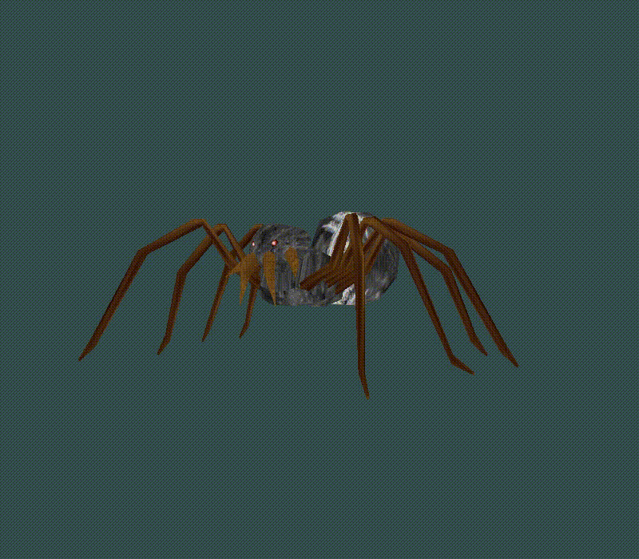
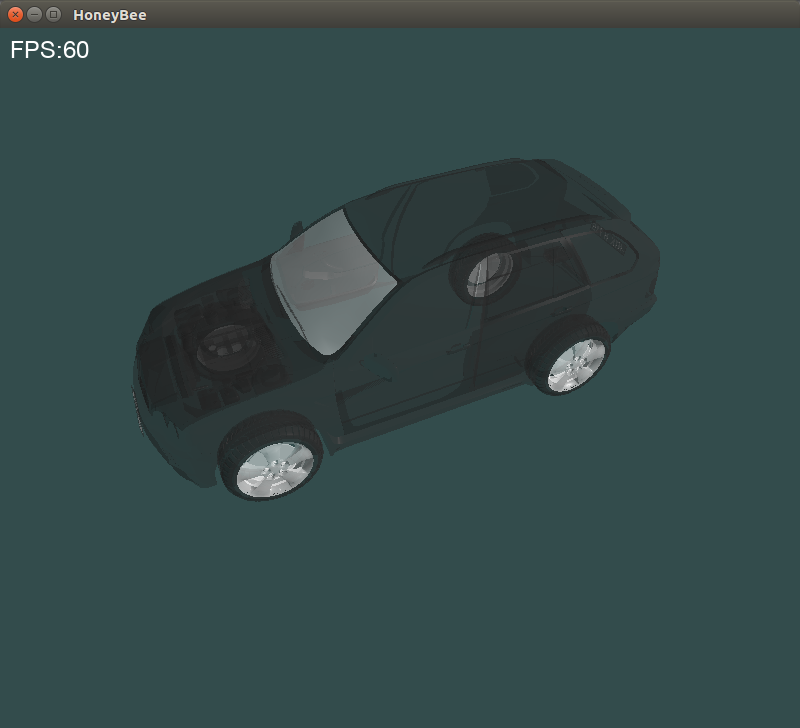

## Introduction
HoneyBee is a 3D engine project for Automotive applications on Imx6 platforms.

Currently it is at the very beginning, but it aims to be developed into a full render engine for Car models and 3D instrument clusters, with extremely high performance and adequate flexibilities.

## Model
We are using Assimp to load 3D models for now, but in the long run, we'll remove Assimp from our code, instead support only .obj loading manually.

## Build
Cmake is used as the automake tool. So it is pretty easy to build the project.

Install assimp and freetype, then just do as follows.
```
cmake .
make
```

## Screeshots



## License
HoneyBee is MIT licensed.

Licenses for both gml and stb should be respected, since they are used by HoneyBee.
Please take a look at their official website for references.

https://glm.g-truc.net

https://github.com/nothings/stb
